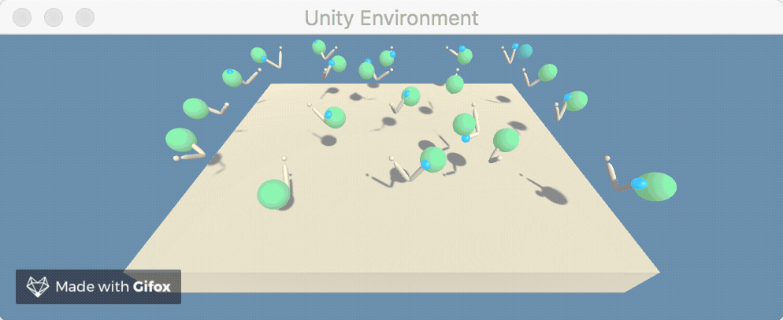

# Project: Continuous Control
## Summary
In this project an agent was trained to solve a episodic continuous control task which involved tracking a moving object using a simulated actuating robotic arm. An example of the task can be seen in the animation below. To solve this task an implantation of the actor-critic based Deep Deterministic Policy Gradient (DDPG) algorithm was created. The algorithm used two standard neural networks with a prioritised replay buffer to learn how to accurately control the motors of the arm to track the object. After hyperparameter tuning, the final model was able to solve the environment after only `236` training episodes.
||
|:--:|
| *Example with the most successful policy rolled out to 20 individual robotic arms.* |


## Problem Statement
### Environment, Reward and Solution:
The environment used is based on the Unity ML-Agents [reacher environment](https://github.com/Unity-Technologies/ml-agents/blob/master/docs/Learning-Environment-Examples.md#reacher) and consists of a 3D space containing a single simulated double-jointed robotic arm. Within the space a moving target region, shown by the blue balls in the figure above, is specified and the agents objective is to maintain the tip of the arm inside this target region. The environment is episodic and lasts for 1000 timesteps. At the start of each episode the target region will change its velocity meaning the agent must learn to match the velocity of the region in each episode.
The agent was given a reward of +0.1 for every timestep where its hand was within the target region and thus, learning to maximise this reward creates the desired behaviour.
This benchmark is classified as solved once the agent can obtain an average reward of >30 over 100 consecutive training episodes.

### State and Action Spaces:
The observed states space of the environment consists of a 33 dimensional vector that encodes details such as position, rotation, velocity and angular velocities. The agent then uses this information along with the actor network to select the action which is likely to maximise the agent's future reward. The action space of the agent is 4 dimensional and relates to the applied torque for the two degrees of freedom available at each joint of the actuating arm. These torques are normalised to be within the range [-1,1] with the sign signifying the direction of application.
## Dependencies
This code must be run in an environment with Python 3.6 kernel and using the dependencies listed in `requirements.txt`. 
 
Please run the following in a fresh Python 3.6 virtual environment. To install the required dependencies please run the following within this environment.
```
pip install -r requirements.txt
``` 
Additionally, you will need to download the Unity environment in which the agent was trained. Instruction for this can be found within the `Continuous_Control.ipynb` notebook or by [following this link](https://github.com/udacity/deep-reinforcement-learning/tree/master/p2_continuous-control#getting-started) and selecting the correct version 1 environment for your system.

## Files
This repository contains the following files and folders:
  
`Figures`: A folder containing graphs obtained during model evaluation.\
`GIFS`: A folder contains some example of trained agents. \
`Papers`: A folder contain the original papers for the methods implemented and mentioned in this project. \
`Final_Agent.pth`: The most sample efficient trained model. This was able to solve the task in `236` episodes. \
`Continuous_Control.ipynb`: The jupyter notebook used to train agents. \
`DDPG_reacher_final.py`: Code containing the implementation of the DDPG algorithm. \
`replay_buffer.py`: Code used to implement both standard and prioritised replay buffer. \
`sum_tree.py`: A basic sum tree used to help efficiently sample prioritised experiences. \
`requirements.txt`: list of dependencies needed for this project.

## Running
Please open and follow the instructions in the `Continuous_Control.ipynb`.

## Implementation and Results

The DDPG algorithm is a model-free off-policy reinforcement learning algorithm outlined in the paper 'Continuous Control with Deep Reinforcement Learning'. DDPG is effectively an extension of the deep-Q learning algorithm to problems in continuous action spaces. In the vein of deep-Q learning, the DDPG algorithm uses a replay buffer and softly updated target network to overcome the problems faced when using neural networks for reinforcement learning tasks. However, an inherent limitation of Q learning based algorithms is the need to greedily select the next action with respect to the Q function, which becomes an intangible optimisation task in continuous domains with large neural networks. To overcome this problem the DDPG algorithm uses an actor-critic paradigm which maintains two separate function approximators. The first, known as the actor as it decides on the agent's actions, is used to represent the agent's current policy and deterministically maps states to actions. The second, referred to as the critic, takes a state-action pair and learns to approximates its Q value.

To solve the object tracking problem described above a custom implementation of the DDPG algorithm was created. In this implementation, neural networks were used for both the actor and critic function. 
The architecture of the actor network can be found in the following table:
| Layer |  Size  
|  ---- | ------
| Input (Observed state) |  33
| Hidden layer 1  | 256
| Hidden layer 2  | 128
| Output (Action) | 4

where each layer is fully connected and uses a <i>ReLU()</i> activation function. After the finally outputs a <i>tanh()</i> function was applied to allow for outputted actions to be within the desired range of [-1,1].

For the critic network the architecture used was: 
| Layer |  Size  
|  ---- | ------
| Input (State-Action pair) |  37
| Hidden layer 1  | 256
| Hidden layer 2  | 128
| Hidden layer 3  | 32
| Output (Approximate Q value) | 1

where again each layer was fully connected and followed by a <i>ReLU()</i> activation function. For critic updates a discount factor of <i>&gamma;</i> = 0.95 was selected. 

Both the actor and critic networks were trained using an Adam optimiser with a learning rate of 0.0003 and 0.0001 respectively. An L<sub>2</sub> weight decay was initially used when training the critic network, however, it was later found that setting this to 0 was just as, if not more, effective. Additionally, a gradient clipping was applied to the weight updates of both networks as it seemed to greatly improve training effectiveness and stop catastrophic forgetting events. The gradient clippings were 0.5 when updating the critic and 1 when updating the actor. 

The implementation used target networks for both the actor and critic networks. These target networks were softly updated at every timestep using a soft update parameter of <i>&tau;</i> = 0.0003.  
Additionally, the experience tuples used for training were selected using a prioritised experience replay (PER) buffer, which prioritises experiences with larger TD-error, as this greatly increased learning efficiency. The following hyperparameters were used for this PER buffer: 
| Hyperparameter |  Value  
|  ---- | ------
| Buffer size |  10000
| <i>&alpha;</i> | 0.7
| Initial <i>&beta;</i>  | 0.2
| <i>&beta;</i> increment  | 0.0001
| Baseline priority | 0.1
| Initial max priority | 1

The agent was trained on batches containing 128 experience tuples selected by the PER buffer at each timestep. 

To help the agent with exploration of the continuous action space, stochastically generated noise was added to the outputs of the actor network. This noise was generated using an Ornstein–Uhlenbeck process with parameter settings <i>&mu;</i> = 0, <i>&theta;</i> = 0.1 and <i>&sigma;</i> = 0.1 .  The noise was slowly decayed with each timestep, <i>t</i>, using a geometrically decaying weight factor defined as <i>w</i> = 0.9995<i><sup>t</sup></i> giving the noise term a half-life of &asymp;1400 timesteps. This weighting factor was frozen once it had reached a minimum of <i>w<sub>min</sub></i> = 0.05.

Initially, a relatively vanilla DDPG algorithm was used to try and solve the problem. However, it was found that almost all agents would fall into one of two traps. The first problem encountered would occur when the agent failed to obtain a strong enough reward signal during the early phase of training and subsequently not learn effectively, in most cases never getting an episodic score above 5. To mitigate this a the PER buffer mentioned above was added and after hyperparameter tuning this problem was greatly reduced. 
The other major pitfall during initial attempts at training was when an agent would achieve a high level of performance but was unable to maintain this performance, either due to plateauing below the threshold or catastrophic forgetting events, for long enough to meet the criteria to solve the environment. This problem seemed to be solved by the addition of the gradient clipping mentioned above. Although these problems do still occasionally occur with the set up described above they are much rarer.

Using this custom DDPG implementation and the hyperparameters described it was possible to train agents that would consistently improve their episodic reward over training and solve the environment. The following graph shows the learning curve of the most sample efficient agent trained. It clearly shows that the agent has effectively trained to a high level of performance and this performance is maintained once reached.
|  |
|:--:|
| *Graph showing the the episodic rewards during training of the agent that solved the environment in the fewest episodes.* |


This agent was able to solve the environment in `236` training episodes as can be seen in the figure below that shows the 100 episode rolling mean during training.
|  |
|:---:|
| *Graph showing the rolling average reward over 100 consecutive episodes and when the agent solved the environment.* |

## Future work
In this project a single actuating arm was used during the training phase. However, the reacher arm environment is capable of operating with multiple arms making it possible to train in a distributed manner. It would be interesting to compare DDPG's performance and efficiency to algorithms such as [Ape-X](https://openreview.net/pdf?id=H1Dy---0Z) or [D4PG](https://openreview.net/pdf?id=SyZipzbCb) which both take advantage of decentralised actors to quickly gather more data during training.

## More GIFs

||
|:---:|
| *Example of an untrained policy on a single arm.*|


||
|:---:|
| *Example of a successful policy on a single arm.*|


||
|:---:|
| *GIF showing agents at the beginning of a new episode. It can be seen that each agent has to find and match the balls velocity.* |


||
|:---:|
| *GIF showing another example of a successful policy rolled out to 20 robotic arms.*|
